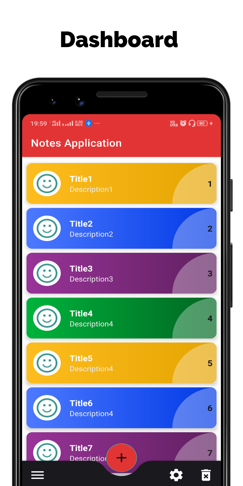
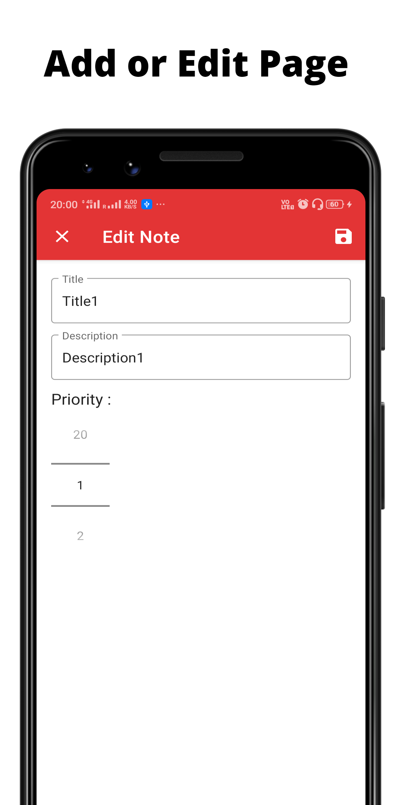

# Notes-Application-with-Room-and-MVVM
This is a simple Notes application. It follows the MVVM design pattern using the Room. Users can simply create, save, edit and delete notes.

## Note: This application-focused is to follow the MVVM architecture using the Room persistent library. #Not focused on UI

### Users can give priority to the notes

